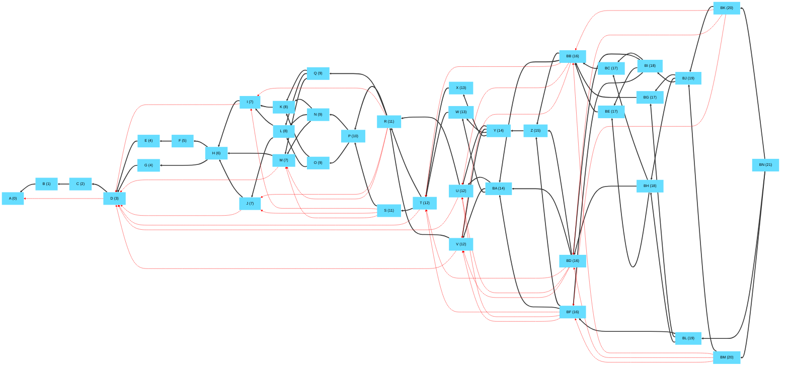
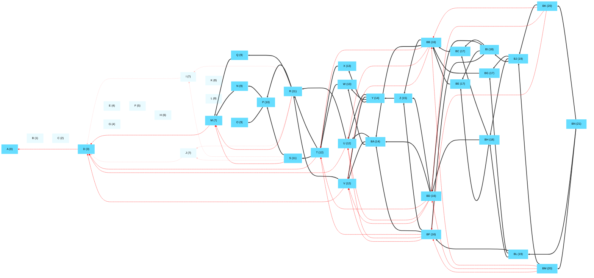
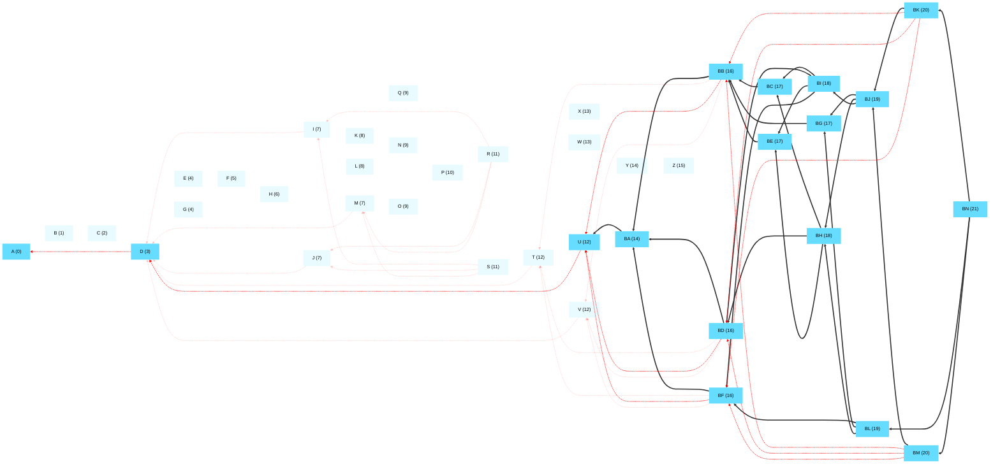

## Full tangle with no deletes

## Delete an old portion of the tangle
- Delete everything before M except cert pool
- Greedy path to root: M->D->A
- CertPool / active msgs: 2 / 28

## Delete more of the tangle
- Delete everything before BA except cert pool
- Greedy path to root: BA->U->D->A
- CertPool / active msgs: 3 / 14

