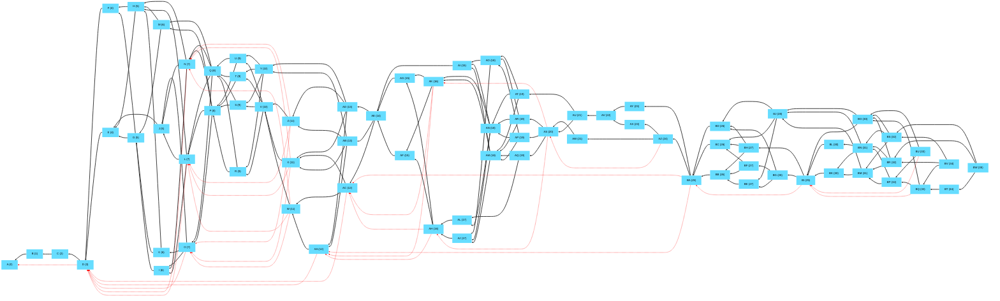
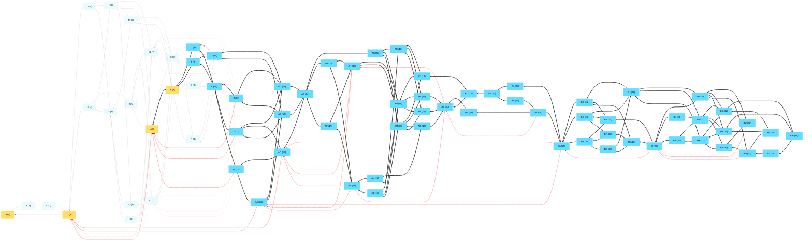

## Full tangle with no deletes

## Delete an old portion of the tangle
- Delete everything before T (19) except cert pool
- Greedy path to root: T->P->L->D->A
- CertPool / active msgs: 4 / 56

## Delete more of the tangle
- Delete everything before AV (47) except cert pool
- Greedy path to root: AV->AU->AS->AH->AA->D->A
- CertPool / active msgs: 6 / 28

```mermaid
graph RL
A["A (0)"]:::cert
B["B (1)"]:::weak
C["C (2)"]:::weak
D["D (3)"]:::cert
E["E (4)"]:::weak
F["F (4)"]:::weak
G["G (5)"]:::weak
H["H (5)"]:::weak
I["I (6)"]:::weak
J["J (5)"]:::weak
K["K (6)"]:::weak
L["L (7)"]:::weak
M["M (6)"]:::weak
N["N (7)"]:::weak
O["O (7)"]:::weak
P["P (8)"]:::weak
Q["Q (8)"]:::weak
R["R (9)"]:::weak
S["S (9)"]:::weak
T["T (9)"]:::weak
U["U (9)"]:::weak
V["V (10)"]:::weak
W["W (11)"]:::weak
X["X (11)"]:::weak
Y["Y (10)"]:::weak
Z["Z (11)"]:::weak
AA["AA (12)"]:::cert
AB["AB (13)"]:::weak
AC["AC (12)"]:::weak
AD["AD (13)"]:::weak
AE["AE (14)"]:::weak
AF["AF (15)"]:::weak
AG["AG (15)"]:::weak
AH["AH (16)"]:::cert
AI["AI (15)"]:::weak
AJ["AJ (17)"]:::weak
AK["AK (16)"]:::weak
AL["AL (17)"]:::weak
AM["AM (18)"]:::weak
AN["AN (18)"]:::weak
AO["AO (18)"]:::weak
AP["AP (19)"]:::weak
AQ["AQ (19)"]:::weak
AR["AR (19)"]:::weak
AS["AS (20)"]:::cert
AT["AT (19)"]:::weak
AU["AU (21)"]:::cert
AV["AV (22)"]
AW["AW (21)"]
AX["AX (23)"]
AY["AY (23)"]
AZ["AZ (24)"]
BA["BA (25)"]
BB["BB (26)"]
BC["BC (26)"]
BD["BD (26)"]
BE["BE (27)"]
BF["BF (27)"]
BG["BG (28)"]
BH["BH (27)"]
BI["BI (29)"]
BJ["BJ (28)"]
BK["BK (30)"]
BL["BL (30)"]
BM["BM (31)"]
BN["BN (31)"]
BO["BO (30)"]
BP["BP (32)"]
BQ["BQ (33)"]
BR["BR (32)"]
BS["BS (32)"]
BT["BT (34)"]
BU["BU (33)"]
BV["BV (34)"]
BW["BW (35)"]
BW==>BR
BW==>BS
BW==>BT
BV==>BQ
BV==>BR
BV==>BS
BU==>BO
BU==>BP
BT==>BQ
BS==>BM
BS==>BN
BS==>BO
BR==>BM
BR==>BN
BR==>BO
BQ==>BO
BQ==>BP
BP==>BM
BP==>BN
BO==>BI
BO==>BJ
BN==>BJ
BN==>BK
BN==>BL
BM==>BJ
BM==>BK
BL==>BI
BK==>BI
BJ==>BC
BJ==>BD
BJ==>BE
BI==>BG
BI==>BH
BH==>BB
BH==>BC
BH==>BD
BG==>BD
BG==>BE
BG==>BF
BF==>BB
BF==>BC
BE==>BB
BD==>BA
BC==>BA
BB==>BA
BA==>AY
BA==>AZ
AZ==>AW
AZ==>AX
AY==>AV
AX==>AV
AW==>AS
AV==>AU
AU==>AS
AU==>AT
AT==>AM
AT==>AN
AT==>AO
AS==>AP
AS==>AQ
AS==>AR
AR==>AM
AR==>AN
AR==>AO
AQ==>AL
AQ==>AM
AP==>AM
AP==>AN
AP==>AO
AO==>AI
AO==>AJ
AN==>AI
AN==>AJ
AN==>AK
AN==>AL
AM==>AI
AM==>AJ
AM==>AK
AL==>AH
AK==>AF
AK==>AG
AJ==>AH
AI==>AE
AH==>AF
AH==>AG
AG==>AE
AF==>AE
AE==>AB
AE==>AC
AE==>AD
AD==>X
AD==>Y
AD==>Z
AD==>AA
AC==>W
AC==>X
AB==>X
AB==>Y
AB==>Z
AB==>AA
AA==>W
Z==>V
Y==>R
Y==>S
Y==>T
Y==>U
X==>V
W==>V
V==>R
V==>S
V==>T
V==>U
U==>P
U==>Q
T==>P
T==>Q
S==>P
S==>Q
R==>P
R==>Q
Q==>L
Q==>M
Q==>N
Q==>O
P==>L
P==>M
P==>N
P==>O
O==>I
O==>J
O==>K
N==>H
N==>I
N==>J
M==>G
M==>H
L==>H
L==>I
L==>J
K==>G
K==>H
J==>E
I==>G
H==>E
H==>F
G==>E
G==>F
F==>D
E==>D
D==>C
C==>B
B==>A
BU-.->BI
BQ-.->BI
BI-.->BA
BA-.->AA
BA-.->AC
AZ-.->AS
AS-.->AH
AS-.->AK
AK-.->AA
AK-.->AC
AH-.->AA
AH-.->AC
AC-.->D
AA-.->D
Z-.->L
Z-.->N
Z-.->O
X-.->L
X-.->N
X-.->O
W-.->L
W-.->N
W-.->O
O-.->D
N-.->D
L-.->D
D-.->A
linkStyle 54,55,56,57,58,59,60,61,62,63,64,65,66,67,68,69,70,71,72,73,74,75,76,77,78,79,80,81,82,83,84,85,86,87,88,89,90,91,92,93,94,95,96,97,98,99,100,101,102,103,104,105,106,107,108,109,110,111,112,113,114,115,116,117,118,119,120,121,122,123,124,125,126,127,128,129,130,131,132,133,134,135,136,137,138,139,140,141,142,143,144,145,146,147,148,149,150,151 stroke:#0002,stroke-width:2;
linkStyle 152,153,154,155,157,158,162,165,178 stroke:#f00,stroke-width:2;
linkStyle 156,159,160,161,163,164,166,167,168,169,170,171,172,173,174,175,176,177 stroke:#f003,stroke-width:2;

classDef default fill:#6df,stroke:#fff0,color:#000
classDef weak fill:#6df2,stroke:#fff0,color:#000
classDef cert fill:#fd6,stroke:#fff0,color:#000
```

