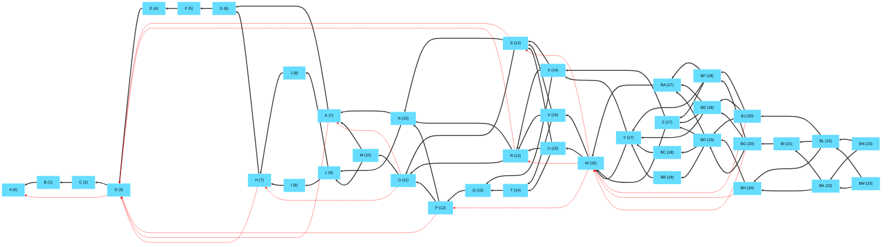
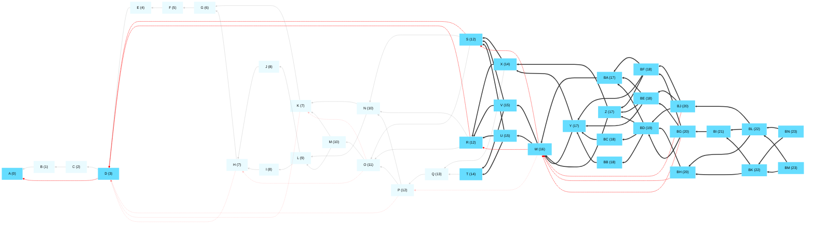
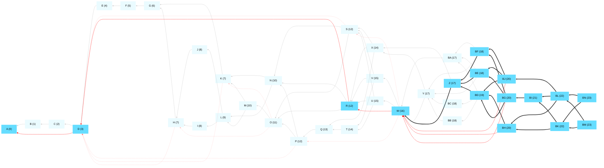

## Full tangle with no deletes

## Delete an old portion of the tangle
- Delete everything before R except cert pool
- Greedy path to root: R->D->A
- CertPool / active msgs: 2 / 23

## Delete more of the tangle
- Delete everything before BD except cert pool
- Greedy path to root: BD->Z->W->R->D->A
- CertPool / active msgs: 5 / 11

